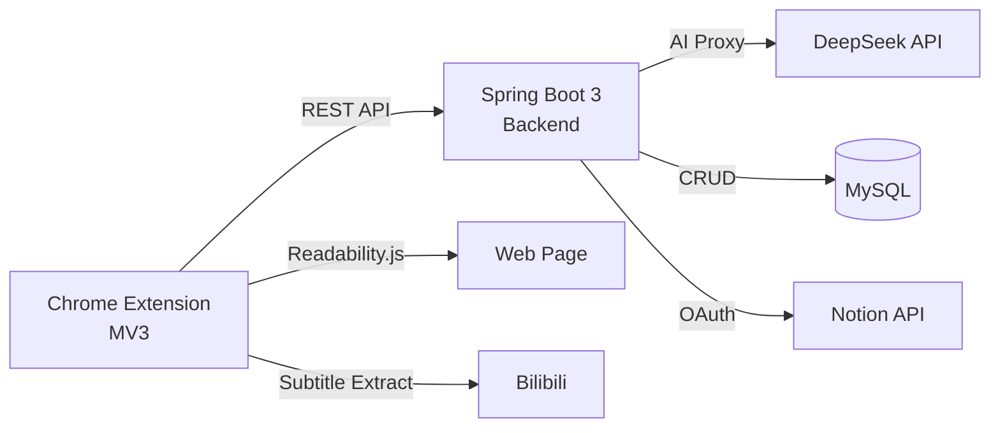

[English](README.md) | [中文](README_zh.md)

<div align="center">

# AI Summary Assistant

**AI-powered Chrome extension that extracts web content and generates structured summaries, mind maps, and translations.**

[](LICENSE)
[](https://www.oracle.com/java/)
[](https://spring.io/projects/spring-boot)
[](https://developer.chrome.com/docs/extensions/mv3/)

</div>

## ✨ Features

- 📄 Extract main content from any webpage (Readability.js)
- 🎬 Extract subtitles from Bilibili videos
- 🧠 AI-generated structured summaries via DeepSeek API
- 🗺️ Interactive mind maps with Markmap
- 🌐 Bilingual output (Chinese/English)
- 📒 Sync to Notion via OAuth / Export to Obsidian & Logseq
- 🔐 JWT + BCrypt authentication
- 🎁 Free trial: 3 AI summaries per user (no API key needed)

## 📸 Screenshots

> Coming soon — GIF demo and screenshots will be added here.

<!-- 

-->

## 🏗️ Architecture



## 🛠️ Tech Stack

| Layer | Technology |
|-------|-----------|
| Frontend | Chrome Extension (Manifest V3), HTML/CSS/JS, Markmap |
| Backend | Java 21, Spring Boot 3, MyBatis-Plus, MySQL |
| AI | DeepSeek API (via backend proxy) |
| Auth | JWT + BCrypt, Notion OAuth 2.0 |
| Deployment | Alibaba Cloud ECS (Ubuntu 24.04) |
| Testing | JUnit 5 + Mockito (24 unit tests) |

## 🚀 Getting Started

### Prerequisites

- JDK 21+
- MySQL 8.0+
- Node.js (for extension development, optional)
- Chrome browser

### Backend Setup

```bash
cd server
cp .env.example .env
# Edit .env with your database credentials and DeepSeek API key
./mvnw spring-boot:run
```

### Extension Setup

1. Open `chrome://extensions/`
2. Enable **Developer Mode**
3. Click **"Load unpacked"** → select the `extension/` folder

## 📁 Project Structure

```
Summary-of-long-video-content/
├── extension/          # Chrome MV3 extension (popup, content scripts, background)
├── server/             # Spring Boot 3 backend
│   └── src/
├── sql/                # Database schema and migrations
├── docs/               # Technical specifications
├── .env.example        # Environment variable template
└── README.md
```

## 🗺️ Roadmap

- [x] Web page content extraction (Readability.js)
- [x] Bilibili subtitle extraction
- [x] AI-powered summary generation
- [x] Mind map visualization (Markmap)
- [x] User authentication (JWT + BCrypt)
- [x] Notion OAuth integration
- [x] Obsidian & Logseq export
- [x] Free trial quota system (3 uses/user)
- [x] Backend unit tests (24 tests)
- [x] Production deployment (Alibaba Cloud)
- [ ] YouTube subtitle extraction
- [ ] Chrome Web Store publication
- [ ] More AI model options

## 📄 License

This project is licensed under the MIT License - see the [LICENSE](LICENSE) file for details.
