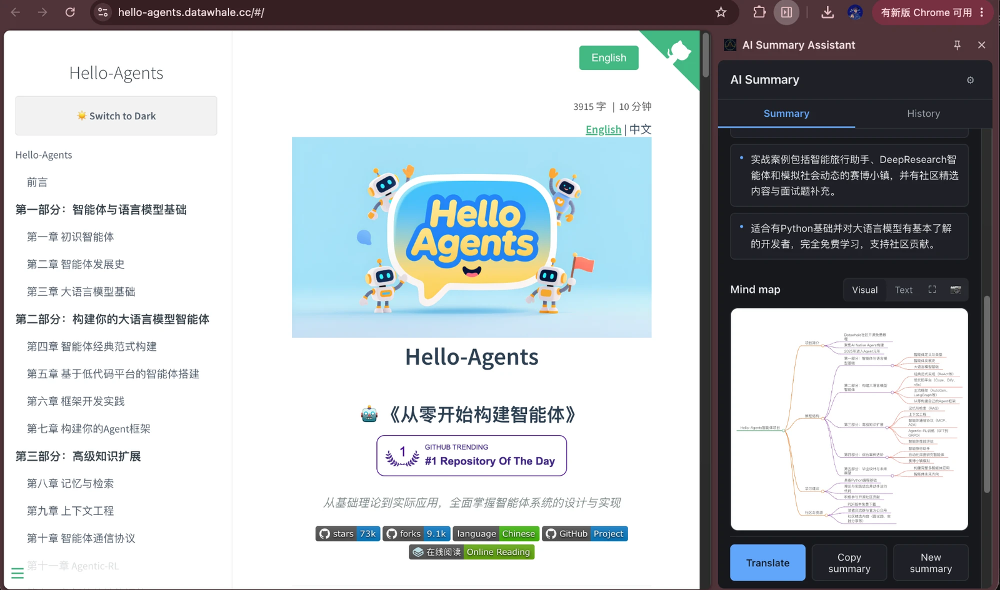
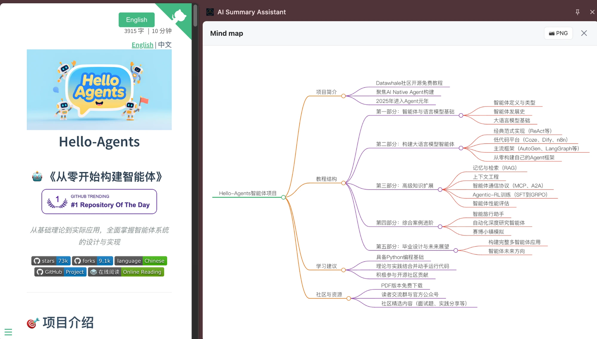
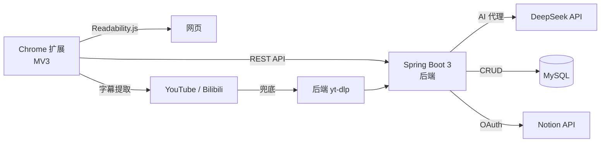

[English](README.md) | [中文](README_zh.md)

<div align="center">

# AI 摘要助手

**基于 AI 的 Chrome 扩展，可提取网页内容并生成结构化摘要、思维导图和翻译。**

[](LICENSE)
[](https://www.oracle.com/java/)
[](https://spring.io/projects/spring-boot)
[](https://developer.chrome.com/docs/extensions/mv3/)

</div>

## ✨ 功能特性

- 📄 使用 Readability.js 提取网页正文
- 📦 支持 GitHub 仓库和技术页面摘要
- 🧠 通过 DeepSeek API 生成结构化摘要、思维导图和多语言翻译
- 🎬 基于字幕的 YouTube/Bilibili 视频摘要，后端 yt-dlp 兜底
- 🚫 无真实字幕时拒绝生成虚假摘要
- 🔓 默认 AI 服务持续可用，3 次后仅软提示配置自己的 API Key
- 📒 Notion OAuth 同步 / Obsidian & Logseq 导出
- 🔐 JWT + BCrypt 用户认证
- 💾 MySQL 存储摘要历史、标签和使用记录
- 🌗 深色模式，自动跟随系统外观
- ♿ 默认可访问 —— 焦点可见、图标按钮有可访问名、尊重减少动效偏好

## 📸 截图展示

在侧边栏中总结开源教程站点，生成结构化摘要与核心要点：



思维导图全屏查看，支持导出 PNG：



## 🏗️ 系统架构



## 🛠️ 技术栈

| 层级 | 技术 |
|------|------|
| 前端 | Chrome 扩展（Manifest V3）、HTML/CSS/JS（设计令牌 + 深色模式）、Markmap |
| 后端 | Java 21、Spring Boot 3、MyBatis-Plus、MySQL |
| AI | DeepSeek API（通过后端代理） |
| 认证 | JWT + BCrypt、Notion OAuth 2.0 |
| 部署 | 阿里云 ECS（Ubuntu 24.04） |
| 测试 | JUnit 5 + Mockito |

## 🚀 快速开始

### 前置条件

- JDK 21+
- MySQL 8.0+
- Node.js（用于扩展开发，可选）
- Chrome 浏览器
- yt-dlp（后端视频字幕兜底所需）

### 后端启动

```bash
cd server
cp .env.example .env
# 编辑 .env 文件，填入数据库凭据和 DeepSeek API 密钥
./mvnw spring-boot:run
```

### 扩展安装

1. 打开 `chrome://extensions/`
2. 启用**开发者模式**
3. 点击**"加载已解压的扩展程序"** → 选择 `extension/` 文件夹

## 📁 项目结构

```
Summary-of-long-video-content/
├── extension/          # Chrome MV3 扩展（弹窗、内容脚本、后台服务）
├── server/             # Spring Boot 3 后端
│   └── src/
├── sql/                # 数据库建表和迁移脚本
├── docs/               # 技术规格文档
├── .env.example        # 环境变量模板
└── README.md
```

## 🗺️ 开发路线图

- [x] 网页内容提取（Readability.js）
- [x] GitHub 仓库摘要
- [x] AI 驱动的摘要生成
- [x] 思维导图可视化（Markmap）
- [x] 用户认证（JWT + BCrypt）
- [x] Notion OAuth 集成
- [x] Obsidian 和 Logseq 导出
- [x] 免费 AI 代理及软性用量提醒
- [x] 基于字幕的 YouTube/Bilibili 视频摘要实现
- [x] 视频 URL 白名单校验
- [x] 后端单元测试（JUnit 5 + Mockito）
- [x] 生产环境部署（阿里云）
- [x] 侧边栏 UI 改版 —— 设计令牌、深色模式、无障碍基线
- [ ] 部署包含 yt-dlp 支持的最新后端
- [ ] 视频字幕兜底功能生产验证
- [ ] Chrome 网上应用店发布
- [ ] 更多 AI 模型选项

## 📄 许可证

本项目基于 MIT 许可证开源 - 详情请参阅 [LICENSE](LICENSE) 文件。
